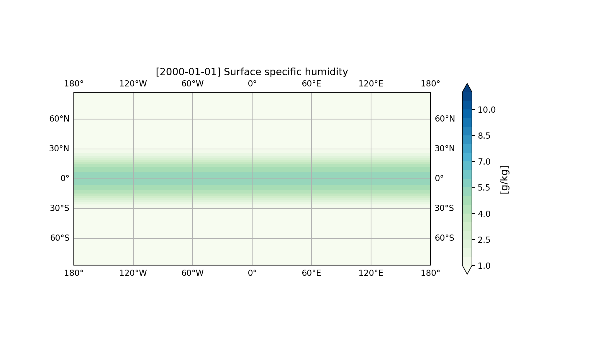

# JAX-ESM: A JAX-based Earth System Model Coupler

JAX-ESM is a JAX-based coupling framework for Earth system components, specifically designed for coupling JCM (JAX Climate Model) with ocean and flux models. It provides efficient time integration using `jax.lax.scan` and supports component-specific sub-stepping for numerical stability.

## Features

- **JAX-Native**: Fully JIT-compilable, GPU-ready, and differentiable
- **Dynamic State Creation**: Factory functions for creating custom component states with arithmetic operations
- **Efficient Time Integration**: Uses `jax.lax.scan` for vectorized time stepping with optional debug mode
- **Component Sub-stepping**: Each component can use internal sub-steps for numerical stability
- **Direct Component Coupling**: Components can directly access each other's state for tight integration
- **xarray Integration**: Built-in conversion to xarray Datasets for analysis

## Installation 

```
# Install JEM
git clone -b v0.1 https://github.com/climate-analytics-lab/jax-esm
cd jax-esm
pip install -e "."
cd ..

# Install jittable Veros (temporary solution)
git clone https://github.com/meteorologytoday/veros-jittable.git
cd veros-jittable
pip install -e "."
```

## Quick Start

Here is an example to run an aquaplanet simulation coupling JCM and an slab ocean model.

```
import jcm
import jax_datetime as jdt

from jem import Coupler
from jem.components import JCM, SlabOceanModel
from jem.mapping import BasicMapper

start_datetime = jdt.to_datetime("2000-01-01")
coupling_timestep = jdt.to_timedelta(1, "day")

interaction_between_atm_and_ocn = BasicMapper()
interaction_between_atm_and_ocn.add_mapping(
    source = ("atm", "derived.total_heat_flux"),
    target = ("ocn", "forcing.total_heat_flux"),
)
interaction_between_atm_and_ocn.add_mapping(
    source = ("ocn", "state.sea_surface_temperature"),
    target = ("atm", "forcing.sea_surface_temperature"),
)

atm_model = jcm.model.Model(
    start_date=start_datetime,
)

atm_model = JCM.make_jem_compatible(
    atm_model,
    coupling_timestep=coupling_timestep,
    land_model_active=False,
)

model = Coupler(
    components=dict(
        atm=atm_model,
        ocn=SlabOceanModel(
            start_datetime=start_datetime,
            timestep=coupling_timestep / jdt.to_timedelta(1, "second"),
        ),
    ),
    mappers=dict(interaction_between_atm_and_ocn=interaction_between_atm_and_ocn),
)

simulation_interval = jdt.to_timedelta(60, "day")
initial_state, final_state, predictions = model.run(
    workflow=["interaction_between_atm_and_ocn", "atm", "ocn"],
    iterations = int(simulation_interval / coupling_timestep),
)

output_dict = model.predictions_to_xarray(predictions)
print(output_dict["atm"]) # xarray.Dataset
print(output_dict["ocn"])
```



## Documentation

For more details, build it locally with:

```
cd jax-esm/docs
pip install -r /path/to/requirements.txt
ln -s ../notebooks .
make html
```

Then open `docs/build/html/index.html` in your browser.

## Architecture

### Component Interface

Each component needs to provide two methods:

- **`initialize()`**: Return initial component carry value, a pytree.
- **`generate_step_function()`**: Return a JIT-compiled step function
  - Signature: `step_function(component_carry, step) -> (new_component_carry, predictions)`

### Component Coupling

The current implementation uses direct coupling:
- Coupler creates a dictionary of componenet carry values.
- Coupler passes the carry value of each component to the corresponding component's `step_function`.
- To exchange variables llike fluxes, pass mapper functions to Coupler. A mapper function receives
  the dictionary of component carry values and returns a new one. 

### Time Integration

- Uses `jax.lax.scan` for efficient time stepping
- Components advance in parallel each coupling timestep
- Debug mode available with `jax_scan=False` (uses Python loop)

## Examples
- `notebooks/01_basic`: Provide aquaplanet setup.
- `notebooks/02_experimental`: Features under developmenet, such as earth-like topography and JCM-Veros coupling

## Integration with JAX-GCM (JCM)
JAX-ESM is specifically designed for coupling JCM (JAX Climate Model) with ocean models.

### Included Components

1. **JCM (Atmosphere)**
   - Location: `jem/components/JCM/`
   - Wraps JCM atmosphere model from jax-gcm
   - Handles conversion between Dinosaur dynamics states and physics states
   - Supports internal sub-stepping

2. **SlabOceanModel**
   - Location: `jem/components/SlabOceanModel/`
   - Mixed-layer ocean with climatological relaxation
   - Anomaly-based SST evolution using Euler backward scheme

3. **SlabLandModel**
   - Location: `jem/components/SlabLandModel/`
   - One layer land with climatological relaxation
   - Anomaly-based land surface temperature evolution using Euler backward scheme

## Contributing

Contributions are welcome! Please:
1. Fork the repository
2. Create a feature branch
3. Add tests for new functionality (see `tests/` for examples)
4. Ensure tests pass: `pytest`
5. Follow existing code style
6. Submit a pull request

## Development Status

- **Version**: 0.1.0 (Alpha)
- **Status**: Prototype coupling framework
- **Production Ready**: Core functionality stable
- **API Stability**: Subject to change

