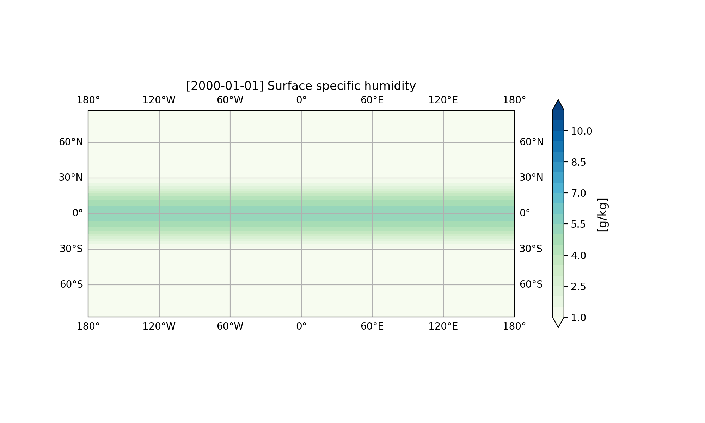

# JAX-ESM

A fully differentiable Earth-system coupler in JAX.

[](https://github.com/climate-analytics-lab/jax-esm/actions/workflows/tests.yml)
[](docs/source/index.rst)
[](LICENSE)


JAX-ESM (`jem`) does not implement a climate model of its own: it couples
independently-developed components — the JCM spectral atmosphere from
[jax-gcm](https://github.com/climate-analytics-lab/jax-gcm) (SPEEDY or
ICON/ECHAM physics), JEM's own slab ocean, land and sea-ice models, and the
[Veros](https://github.com/meteorologytoday/veros-jittable) ocean GCM — into
one JIT-compiled, end-to-end differentiable `jax.lax.scan` trajectory. Every
component's physical parameters travel in the scan carry as pytrees, so
`jax.grad` reaches them through a whole coupled run: calibration against
observations, hybrid physics-ML and sensitivity studies, with no adjoint
model to write ([example](examples/01_basic/03_aquaplanet_response_to_SST_perturbation_using_gradient.ipynb)).

- **Any model plugs in.** A component is any object with a `name`,
  `initialize()` and `step(carry, time)` — a protocol, not a base class.
- **Explicit coupling.** Components exchange fields only through exchangers:
  plain functions that regrid, convert units or compute a flux.
- **One clock.** Every component steps on the same `jax_datetime` clock, and
  every component's output merges onto one time axis.
- **One run loop.** `run_chunked` handles chunking, output, checkpoint/resume
  and a health gate, with in-scan monthly means for long runs.
- **One command.** `python -m jem.main` composes a coupled model from Hydra
  config groups, with named configurations from an aquaplanet slab ocean to
  a Veros Earth.



## Installation

JAX-ESM is developed and tested against **one** jax-gcm revision, recorded in
[`jem/components/jcm/contract.py`](jem/components/jcm/contract.py). jax-gcm
`>=3.0` is not yet on PyPI, so install it from source first:

```bash
git clone https://github.com/climate-analytics-lab/jax-gcm
cd jax-gcm && git switch dev && pip install -e "." && cd ..

git clone https://github.com/climate-analytics-lab/jax-esm
cd jax-esm && pip install -e "." && cd ..

# Optional: the jittable Veros fork, only needed for the Veros configurations
git clone https://github.com/meteorologytoday/veros-jittable.git
cd veros-jittable && pip install -e "."
```

See [`docs/source/getting_started.rst`](docs/source/getting_started.rst) for
the full install and [`docs/source/developers.rst`](docs/source/developers.rst)
for a development install and the test/lint gates.

## Quick start

A complete, runnable aquaplanet simulation coupling the JCM atmosphere to
JEM's slab ocean — a couple of minutes on a laptop CPU:

```python
import jax_datetime as jdt
import jcm
from jcm.physics.speedy.speedy_coords import get_speedy_coords

from jem import Coupler, default_exchangers, run_chunked
from jem.components import JCMComponent, SlabOceanModel
from jem.components.slab import SlabGrid

start_date = jdt.to_datetime("2000-01-01")
coupling_timestep = jdt.to_timedelta(1, "day")

# The JCM atmosphere: a plain jcm.model.Model, wrapped as a component.
atm_model = jcm.model.Model(coords=get_speedy_coords(), start_time=start_date)
atm = JCMComponent(atm_model)

# Aquaplanet: the slab grid is built from the atmosphere's own horizontal grid,
# and with no fractional mask every cell is ocean.
grid = SlabGrid.from_coords(atm_model.coords.horizontal)

# An exchanger is the only place where components exchange information.
# `default_exchangers` is the standard wiring written down once — here, the
# atmosphere's surface heat flux drives the ocean and the ocean's SST comes
# back as the atmosphere's boundary condition — filtered to whichever of the
# standard components (`atm`, `ocn`, `lnd`, `seaice`) are present.
components = {"atm": atm, "ocn": SlabOceanModel(grid)}
coupler = Coupler(
    components,
    default_exchangers(components),
    coupling_timestep=coupling_timestep,
    start_date=start_date,
)
print(repr(coupler))

# One run loop for every coupled run: integrate a chunk, write one file per
# component, check the atmosphere is still healthy, repeat. Every run default
# lives on `run_chunked` itself. Each file is named after the coupled step its
# chunk starts at, so this writes `atm-00000000.nc` and `atm-00000005.nc`
# (and the ocean's two) into `output/`.
result = run_chunked(
    coupler, total_time="10 days", chunk="5 days", output_dir="output"
)
print(result.steps_completed, "coupled steps;", len(result.paths), "files")
```

The same run, composed from Hydra config groups instead of built by hand:

```bash
python -m jem.main +configuration=aquaplanet-slab coupled_run=short_run
```

See [`docs/source/getting_started.rst`](docs/source/getting_started.rst) for
every override, and [`docs/source/python_api.md`](docs/source/python_api.md)
for the complete construction (the declarative exchange table, parameters,
long runs and checkpoints).

## Documentation

- [Getting started](docs/source/getting_started.rst) — install, your first coupled run, the command line
- [Python API](docs/source/python_api.md) — the complete direct-Python construction
- [Design notes](docs/source/design.rst) — the coupling core, carry and clock, exchangers, chunked runs and checkpoints, configuration
- [Adding a component](docs/source/adding_a_component.rst) — wrapping an external model to join a coupled run
- [Examples](docs/source/examples.rst) — every example notebook and configuration, and the command that runs it

## Contributing

See [`docs/source/developers.rst`](docs/source/developers.rst) for a
development install and the gates (`ruff`, `pytest`, `mypy`) that must pass
before a pull request, and `CLAUDE.md` for the project's conventions.

## License

MIT — see [LICENSE](LICENSE).
