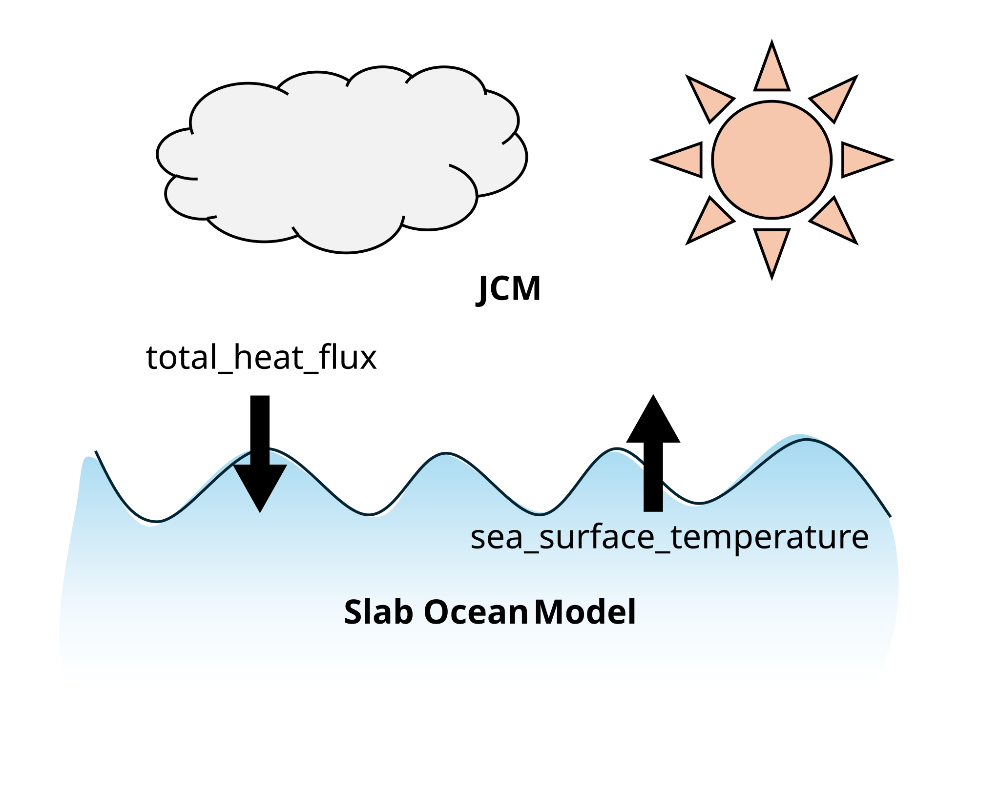

Tutorial: Integrate an Existing Model into JEM
==============================================

In this tutorial, we are going to couple a differentiable global atmosphere
model `JCM <https://github.com/climate-analytics-lab/jax-gcm>`__ to a slab
ocean model provided by JEM (Figure 1).

         ocean model
   :align: center

   Figure 1: Schematic diagram showing the relationshipe between JCM and
   the slab ocean model. The atmosphere model needs the sea surface
   temperature, and the ocean model needs the heat flux.

Step 1: Identifying the Gap to be JEM-compatible
------------------------------------------------

A component is any object satisfying the
:class:`jem.base.component.Component` protocol, which asks for three things:

1. :code:`name: str` — the component's name in the coupler's workflow, in the
   coupled carry and in its output.
2. :code:`initialize() -> Carry` — returns the initial carry value. It must
   **not** integrate the model; building the initial pytrees is all it may do.
3. :code:`step(carry, time) -> tuple[Carry, Diagnostics]` — advances the
   component by one coupling timestep.

   - :code:`time` is a :class:`jem.base.component.CouplingTime`: the coupler's
     clock (step index, simulation time in seconds, and the static calendar
     facts behind :code:`time.year_fraction`). The component keeps no clock of
     its own.
   - The returned carry must have exactly the pytree structure, shapes and
     dtypes of the one :code:`initialize` produced — that is what
     :code:`jax.lax.scan` requires. Two pytrees can be compared with
     :code:`jax.tree_util.tree_structure`.
   - :code:`Diagnostics` is this step's output pytree. The coupler stacks it
     over the run, giving every leaf a leading time axis.

The protocol is *runtime-checkable*, which for a :code:`typing.Protocol` means
"has these attributes": there is no base class to inherit from, and the coupler
raises :code:`TypeError` naming the missing member if an object does not
qualify.

Three further capabilities are optional and are detected with
:code:`isinstance` where they are used:
:class:`~jem.base.component.SupportsXarray` (:code:`to_xarray(diagnostics,
time)`), :class:`~jem.base.component.SupportsBind` (:code:`bind(*,
coupling_timestep, start_date, calendar)`) and
:class:`~jem.base.component.SupportsCheckpoint`
(:code:`save_state`/:code:`load_state`).

The :code:`Carry` in JEM refers to the state object that is passed
from one iteration of a loop to the next, which is the same concept as
elaborated in `jax.lax.scan <https://docs.jax.dev/en/latest/_autosummary/jax.lax.scan.html>`__
. In the science field, this corresponds to the "state" of the system, carrying
necessary information for the system to evolve in time. In JEM, the carry value
means more than that. Carry values also include (1) any variables that will
participate in differentiability of the resulting model, such as forcing or
physical parameters, and (2) convenient variables that can be but hard to
diagnosed from the state, such as turbulent heat fluxes.

Therefore, the desired coupling feature determines the structure of carry values
, which decide how much adaptation one would need to integrate the chosen model
into JEM. In our case, we want to (1) allow JCM to export the total heat flux
such that the slab ocean model use it. However, because heat fluxes are not part
of the model state variables. Also (2) we want to force JCM with the sea surface
temperature simulated in the slab ocean model, which is the :code:`ForcingData`
of the native JCM objects. Therefore, we need to encapsulate the heat flux and
sea surface temperature forcing variable into the carry of JCM.
The carry structure the adapter adopts is

.. code-block:: python

    # carry of the JCM component
    {
        "state":   jcm_native_modal_state,
        "physics": jcm_cross_step_physics_carry,  # threaded back in every step
        "forcing": jcm_native_forcing_data,       # holds sea_surface_temperature
        "derived": JCMDerived(
            physics,                # JCM's own per-step diagnostics, opaque
            total_heat_flux,        # W/m^2, positive upward
            total_freshwater_flux,  # kg/m^2/s, positive upward (evap - precip)
            evaporation, precipitation, u0, v0,
        ),
    }

For the slab ocean model, the carry is

.. code-block:: python

    # carry of the slab ocean model
    {
        "params":  SlabOceanParameters(...),   # differentiable tunables
        "state":   OceanState(sea_surface_temperature),
        "forcing": OceanForcing(total_heat_flux, q_flux),
        "derived": OceanDerived(...),
    }

Neither carries a simulation time: the coupler owns the one clock and hands it
to :code:`step`.

Step 2: Write the Wrapper
-------------------------

JEM ships this wrapper for JCM, so you do not have to write one yourself:
:class:`jem.components.jcm.component.JCMComponent` holds a
:code:`jcm.model.Model` and satisfies the protocol on its behalf. It is a
wrapper *object*, not an in-place adaptation — nothing is attached to the model,
so the atmosphere you configured is the atmosphere JEM drives.

:code:`bind` is how the component learns the coupler's clock. The coupler calls
it once, when the component is registered, and this is the place to refuse a
configuration that cannot work:

.. literalinclude:: ../../jem/components/jcm/component.py
   :language: python
   :pyobject: JCMComponent.bind
   :linenos:

:code:`step` then advances the atmosphere by exactly one coupling interval:

.. literalinclude:: ../../jem/components/jcm/component.py
   :language: python
   :pyobject: JCMComponent.step
   :linenos:

Four things to note:

- :code:`initialize` does not integrate: it builds the initial pytrees from
  :code:`Model.bootstrap_state()` plus a structural template of the diagnostics
  dict. An earlier adapter ran a whole throwaway coupling step just to learn
  that structure, which cost a step per run *and* started the atmosphere one
  interval ahead of the coupler's clock.
- The **physics carry is threaded**: JCM keeps cross-step physics state
  (sub-cycled radiation, prior-step TKE, term-to-term tendencies) in a carry
  that :code:`run_from_state_with_carry` takes in and hands back. It lives under
  :code:`carry["physics"]` and goes straight back in; dropping it would reset
  that memory once per coupling interval.
- :code:`step` calls :code:`model.run_from_state_with_carry()` with the coupling
  interval as both :code:`save_interval` and :code:`total_time`, so JCM
  sub-steps internally at its own timestep and returns one saved record per
  coupling step.
- The surface fluxes are converted on the way out, in
  :mod:`jem.components.jcm.exchange_fields`: JCM publishes :code:`hfluxn`
  downward positive and its water fluxes in :code:`g m-2 s-1`, and JEM's
  convention is upward positive in :code:`kg m-2 s-1`. Doing this once, at the
  component boundary, is what keeps every exchanger downstream sign- and
  unit-consistent.

Step 3: Exchange Variables Between Components
---------------------------------------------

An exchanger is a plain function
:code:`(dict[str, Carry], CouplingTime) -> dict[str, Carry]`. It is traced with
the rest of the coupled step, so it must build new structs rather than assign
into the carries it was handed, and must not change their pytree structure:

.. code-block:: python

    def interaction_between_atm_and_ocn(components, time):
        del time  # this exchange does not depend on the date
        atm, ocn = components["atm"], components["ocn"]

        atm = dict(atm, forcing=atm["forcing"].replace(
            sea_surface_temperature=ocn["state"].sea_surface_temperature,
        ))
        ocn = dict(ocn, forcing=ocn["forcing"].replace(
            total_heat_flux=atm["derived"].total_heat_flux,
        ))

        return dict(components, atm=atm, ocn=ocn)

The clock is passed in so a time-dependent coupling (a ramped forcing, a lagged
exchange) needs no state of its own.

Step 4: Couple JCM to the Slab Ocean Model
------------------------------------------

.. code-block:: python

    aquaplanet_grid = SlabGrid.from_coords(atm_model.coords.horizontal)

    coupler = Coupler(
        {
            "atm": JCMComponent(atm_model),
            "ocn": SlabOceanModel(aquaplanet_grid),
        },
        {"interaction_between_atm_and_ocn": interaction_between_atm_and_ocn},
        coupling_timestep=coupling_timestep,
        start_date=start_date,
    )

    simulation_interval = jdt.to_timedelta(10, "day")
    run = coupler.generate_trajectory_function(
        int(simulation_interval / coupling_timestep)
    )
    final_carry, diagnostics = run(coupler.initialize())

    output_dict = coupler.to_xarray(diagnostics)

The workflow defaults to every exchanger followed by every component, which for
this model is :code:`("interaction_between_atm_and_ocn", "atm", "ocn")` — pass
:code:`workflow=[...]` to the constructor to choose a different coupling scheme.

Full Code
---------

:doc:`quick_start` puts exactly these four steps together into one
self-contained script you can copy and run.
